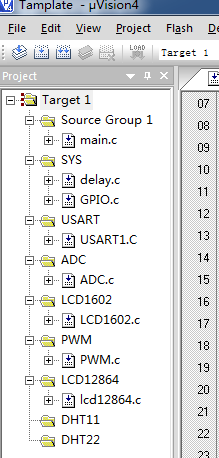
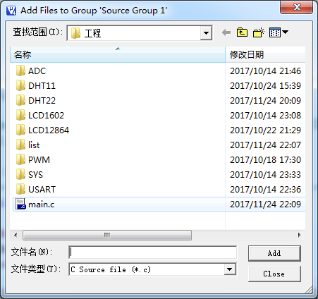
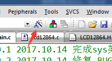
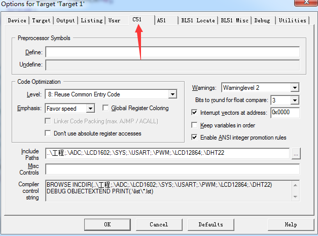
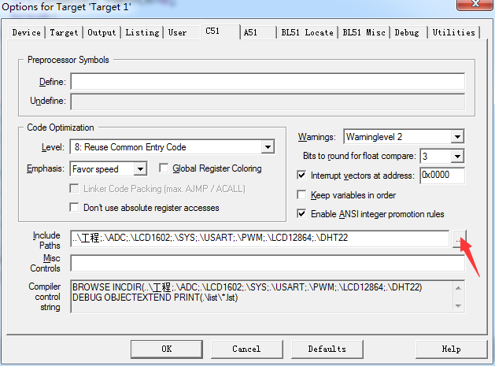
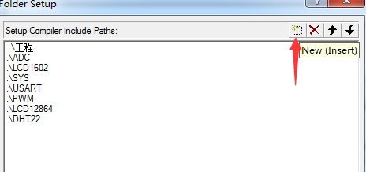
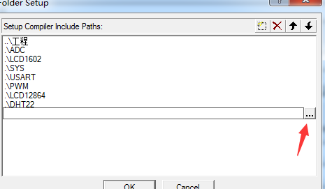
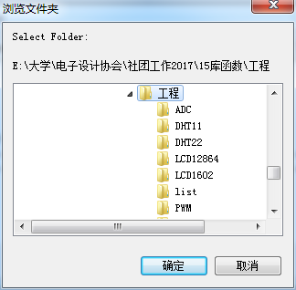

准备
====

适用于stc15系列，使用时请将c文件加入KEIL，并引入相应头文件目录！

加入需要的c文件
---------------

双击 Source Group 1

>   双击所需c文件

添加头文件目录
--------------

寻找刚才C文件所在目录，添加即可。

下再程序注意：KEIL生成的二进制文件位于list文件夹

首次打开工程因无list文件夹会出现一个警告，忽略即可。第二次即无。

SYS模块
=======

提供基础延时函数和GPIO初始化。

延时time个毫秒
--------------

delay_ms(time);*//time为unsigned int型*

初始化IO
--------

GPIO_INIT();*//所有GPIO配置为准双向*

USART模块
=========

默认配置串口1,P30_P31,使用定时器2 默认波特率115200,格式8,1

功能：

printf功能
----------

已配置好，可使用c语言printf()标准函数将信息打印到串口

例如：

printf("hello world**\\n**");

scanf()功能
-----------

使用c标准库函数来向单片机发送命令

注意：stc isp 内串口对此实验显示可能不正确，字符串以\\n判定结束

scanf("%4s %d",name,\&age);

自动中断读写BUF（需要打开EA总开关） 
------------------------------------

TX1_Buffer //发送缓冲数组

RX1_Buffer//接收缓冲数组

实例
----

void usart_demo(){

int age=0;

unsigned char name[5]={"name"};

printf("name age**\\n**");

scanf("%4s %d",name,\&age);

printf("name:%sage:%d**\\n**",name,age);

}

ADC模块
=======

内部ADC驱动

初始化
------

调用ADC_config(ADC_IO);//ADC基础配置，准备ADC_IO口

参数ADC_IO:

\#define ADC_P10 0x01 *//IO引脚 P1.0*

\#define ADC_P11 0x02 *//IO引脚 P1.1*

\#define ADC_P12 0x04 *//IO引脚 P1.2*

\#define ADC_P13 0x08 *//IO引脚 P1.3*

\#define ADC_P14 0x10 *//IO引脚 P1.4*

\#define ADC_P15 0x20 *//IO引脚 P1.5*

\#define ADC_P16 0x40 *//IO引脚 P1.6*

\#define ADC_P17 0x80 *//IO引脚 P1.7*

\#define ADC_P1_All 0xFF *//IO所有引脚*

获取ADC转换值
-------------

结果为10位，int类型 1\~1024

Get_ADC10bitResult(u8 channel); *//channel = 0\~7*

参数channel：0\~7分别对应通道P1.0-P1.7

实例
----

unsigned int result=0;

ADC_config(ADC_P10);*//初始化P10为ADC通道*

result=Get_ADC10bitResult(0);*//获取P10通道ADC值*

printf("ADC:%d**\\n**",result);

LCD1602模块
===========

1602驱动

硬件连接，IO分配设置位于LCD1602.h
---------------------------------

初始化 
-------

函数：LCD1602_init();

LCD1602_init();

打印信息至LCD
-------------

本模块提供print_lcd()函数，使用方法与printf()完全相同,例如：

print_lcd ("1+1=%d",(int)2);

PWM模块
=======

6路PWM控制器驱动

初始化
------

PWM_INIT(DUTY);

初始化PWM周期，DUTY取值1-32767 最大周期即为32767/(主频/16)秒

开启通道
--------

PWM_CHN_ENABLE(CHN)

初始化PWM通道

CHN取值1-6

对应IO:

通道1：P3.7

通道2：P2.1

通道3：P2.2

通道4：P2.3

通道5：P1.6

通道6：P1.7

设置占空比
----------

PWM_set_ratio(duty,chn);

duty 取值1-PWM周期，duty应==占空比\* PWM周期

chn 1-6

接口重映射
----------

PWM_port_remap(unsigned char chn, bit enable)

Chn 通道号

Enabe 1:使能0：否

LCD12864模块
============

提供LCD12864核心驱动和显示函数

注意：中文个别字符有乱码BUG，系KEIL编译器导致，可尽量多用英文或安装补丁

初始化
------

调用init_LCD12864()函数，IO分配设置位于LCD12864.h

打印信息到屏幕
--------------

使用高级函数print_lcd12864(char\* fmt ,...)；

使用语法与printf（）相同

例如：print_lcd12864(“1+1=%d\\n”,(int)2);

注意本函数需要手动换行，只限‘\\n’方式

使用底层写字符函数
------------------

也可使用底层写字符函数

void disp_string_LCD12864(unsigned char x,unsigned char y,unsigned char \*s);

功能：显示一个字符串s到液晶 x：第x行，y：第y列，从第X行第Y列开始写

实例
----

unsigned int adder=0;

init_LCD12864();*//初始化LCD*

print_lcd12864("1+1=%d**\\n**",(int)2);*//显示数字2*

*//下面体现这钟的优势，写一个秒表，每秒加1*

**while**(1){

adder++;

print_lcd12864("adder:%d**\\n**",adder);

delay_ms(1000);

}

KEY按键
=======

为一个带中断的按键模板

初始化
------

void key_init();

外部按键使用轻触开关，使用上拉电阻，以下程序配置为了下降沿触发

外部中断引脚：

INT0(P3.2)

INT1(P3.3)

INT2(P3.6)固定为下降沿触发

INT3(P3.7)固定为下降沿触发

INT4(P3.0)固定为下降沿触发

中断服务
--------

修改位于KEY.c中的如下函数的*//你的代码*位置

*/\*\*\*\*\*\*\*\*\*\*\*\*\*\*\*\*\*\*\*\*\* INT0中断函数
\*\*\*\*\*\*\*\*\*\*\*\*\*\*\*\*\*\*\*\*\*\*\*\*\*/*

void Ext_INT0 (void) interrupt INT0_VECTOR *//进中断时已经清除标志*

{

delay_ms(10);

**if**(P32==0){

*//开始执行中断服务部分*

*//你的代码*

}

}

外部中断
========

外部中断配置函数

注意：别忘记开启总中断开关EA

配置函数
--------

EXTI_config(u8 EXTI_Mode,u8 EXTI_Polity,u8 EXTI_Interrupt,u8 EXT_chn) ;

参数定义如下

EXTI_Mode：中断方式

可选值：

EXT_MODE_RiseFall 0 //上升沿/下降沿中断

EXT_MODE_Fall 1 //下降沿中断

EXTI_Polity：中断优先级

可选值：

PolityLow 0 //低优先级中断

PolityHigh 1 //高优先级中断

EXTI_Interrupt：是否允许中断

可选值

ENABLE 1

DISABLE 0

EXT_chn：使能的外部中断通道

可选值：

EXT_INT0 0 //初始化外中断0

EXT_INT1 1 //初始化外中断1

EXT_INT2 2 //初始化外中断2

EXT_INT3 3 //初始化外中断3

EXT_INT4 4 //初始化外中断4

实例
----

EXTI_config(EXT_MODE_Fall,PolityHigh,ENABLE,EXT_INT0);

初始化配置INT0，下降沿触发，高优先级，使能中断

DS1302
======

DS1302模块是一个数字时钟，本模块提供其驱动

接口定义在头文件中

初始化
------

Ds1302Init();//init

使用
----

Ds1302ReadTime();//读取值到缓冲

结果存储在TIME[]数组中

定义如下

TIME[2] 时

TIME[1] 分

TIME[6] 年

TIME[4] 月

TIME[3] 日

TIME[5] 1\~7 星期一\~星期日

Runtime 执行时间测试
====================

本模块提供代码的执行时间测试，通过串口输出结果，使用串口1

使用
----

\#include *"Runtime.h"*

Runtime_init();

Runtime_start();*//启动*

*//被测试代码如下*

delay_ms(1);

Runtime_stop();*//结束*

DHT11
=====

温湿度传感器模块

使用
----

默认使用P07 为数据引脚 修改头文件中 \#define dht_dat P07以变更

使用实例

init_DHT11();

**while**(1){

delay_ms(1000);

getdat_DHT11();

print_lcd12864("hum:**\\n**%d**\\n**",(int)Sensor_Data_DHT11[2]);

}

其中Sensor_Data_DHT11为全局变量，内容依次为温度整数部分和温度小数部分，湿度整数部分和湿度小数部分和校验，可选择是否使用，具体参照数据手册

Global全局变量
==============

在复杂的c项目中，将全局变量但放到一个global.c文件中声明，并且在头文件中extern暴露出去，其他文件只需include
global.h即可，使得工程结构更加清晰。
